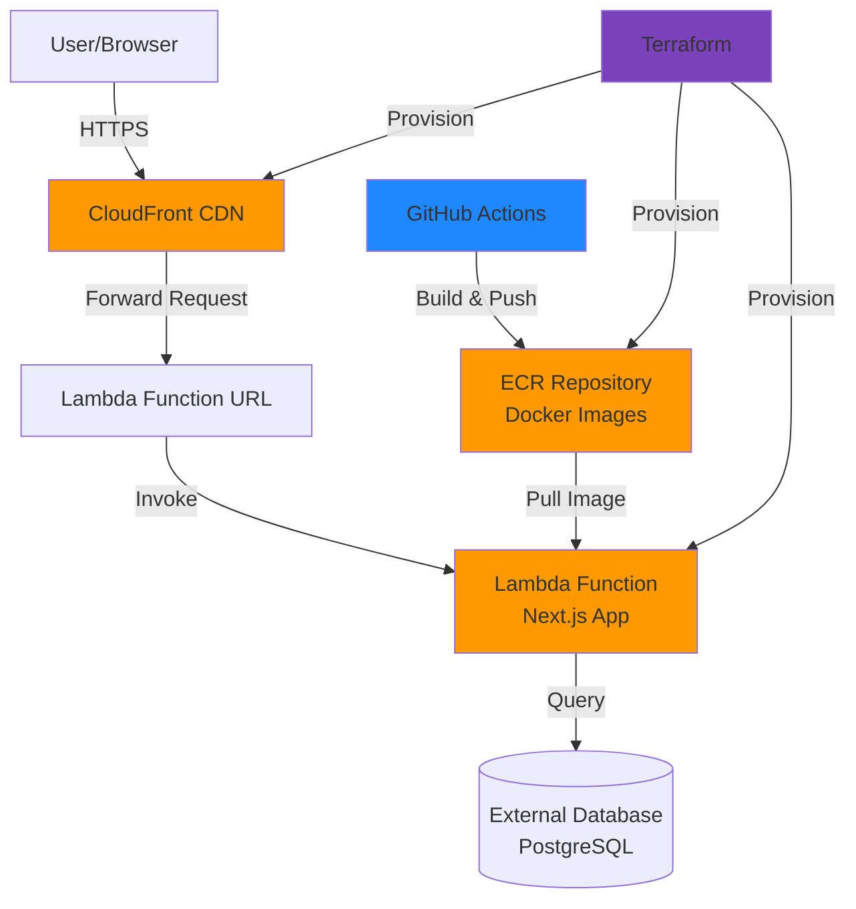

---

## Introduction

Deploying Next.js applications to AWS can be challenging, especially when balancing security, cost-efficiency, and automation. This article presents a production-ready deployment strategy using **AWS Lambda**, **CloudFront**, **ECR**, and **Terraform**.

---

## Why This Approach?

Traditional deployment methods like EC2 instances or ECS clusters can be:
- **Expensive**: You pay for idle time and over-provisioned resources
- **Complex**: Requires managing servers, auto-scaling, and load balancers
- **Less secure**: More attack surface with always-on servers

---

## Architecture Overview

Our deployment architecture consists of the following AWS services:

---

## Key Benefits

- **Pay-per-request pricing** (no idle costs)
- **Automatic scaling** from zero to thousands of requests
- **Reduced attack surface** with ephemeral compute
- **Built-in high availability** across multiple availability zones
- **Infrastructure as Code** for reproducible deployments

---

## Containerization Strategy

Efficient Docker images are critical for fast deployments and reduced costs. We use a **multi-stage build** to optimize image size and security.

---

## Security Best Practices

Security should be built into every layer of your deployment:

- **Non-root user**: All processes run as `nextjs` user
- **Minimal base image**: Alpine Linux reduces attack surface
- **Image scanning**: ECR automatically scans for vulnerabilities
- **HTTPS everywhere**: CloudFront enforces HTTPS

---

## Cost Analysis

Understanding costs helps optimize your deployment.

| Service | Usage | Cost |
|---------|-------|------|
| **Lambda Requests** | 100,000 requests | $0.02 |
| **Lambda Compute** | 50,000 GB-seconds | $0.83 |
| **CloudFront** | 100,000 requests + 10 GB | $0.86 |
| **Total** | | **~$2.26/month** |

---

## Conclusion

Deploying Next.js applications to AWS using Lambda, CloudFront, and Terraform provides a robust, scalable, and cost-effective solution.
